# Docker

## Task-1

``` docker -v ```

Command is used to get the currently installed version of docker


``` docker pull docker/getting-started```

Command is used to pull images from the docker repository


``` docker images```

Command is used to list all the docker images available locally in your system.


```docker run -d -p 80:80 docker/getting-started```

Command is used to run the docker image


```docker ps```

Command is used to list the running containers


```docker ps -a```

Command is used to show all the running and exited containers


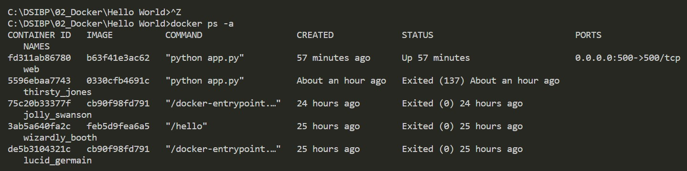


```docker rename fd311ab86780 web```

Command is used to rename the containers

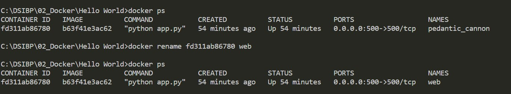

```docker rm thirsty_jones```

Command is used to delete the containers

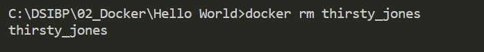

``` docker stop de5b3104321c```

This command stops a running container


```docker exec -it fd311ab86780 bash```
This command is used to access the running container

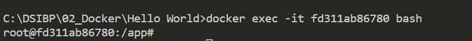


```docker image rm -f cb90f98fd791```

Command is used to remove the image


```docker rmi -f hello-world```
Command is used to remove the image by using given image name

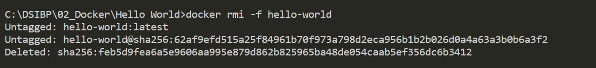


```docker build -t anuragsh31/helloapp .```

Command is used to build docker image in repository

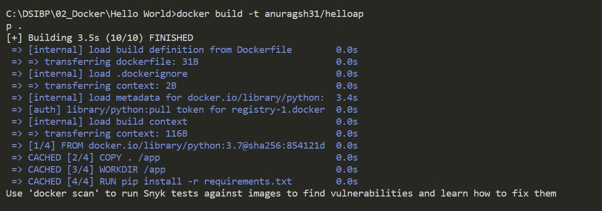


```docker push anuragsh31/helloapp:latest ```

This command is used to push an image to the docker hub repository

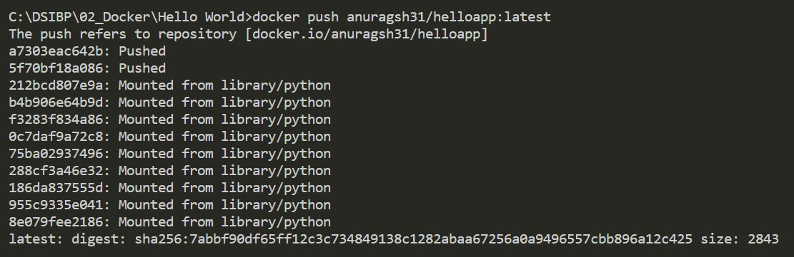


```docker system df```


Command is used to show docker disk usage

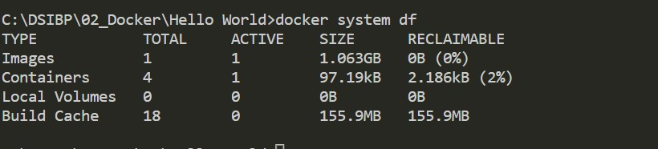


## Task-2:


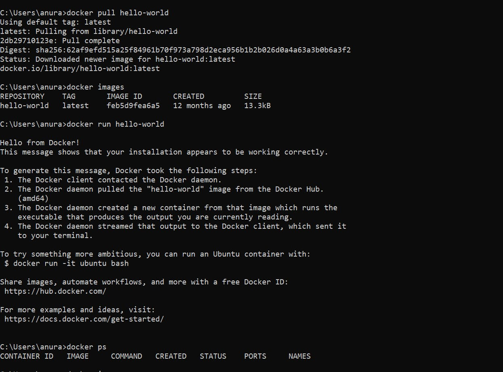


## Task-3:

[Hello_world_application](https://github.com/anuragsh31/Docker/tree/master/Hello_World_Application)


## Task -4

[Application](https://github.com/anuragsh31/Docker/tree/master/App)

[DockerHub](https://hub.docker.com/r/anuragsh31/newapp)


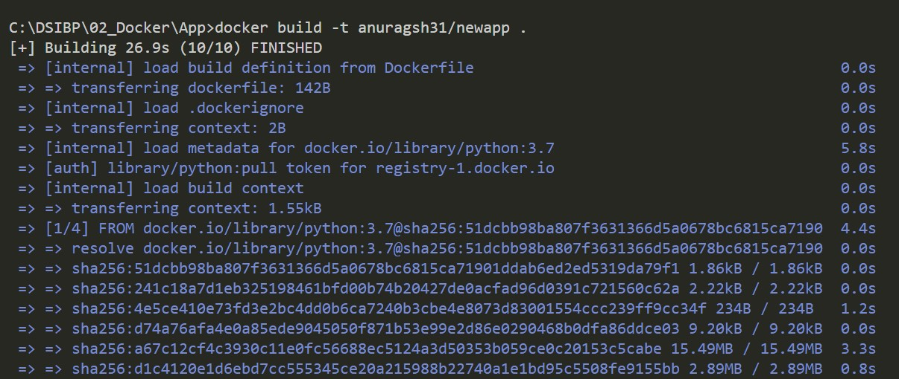

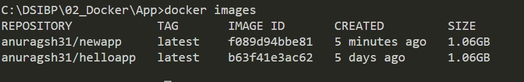
